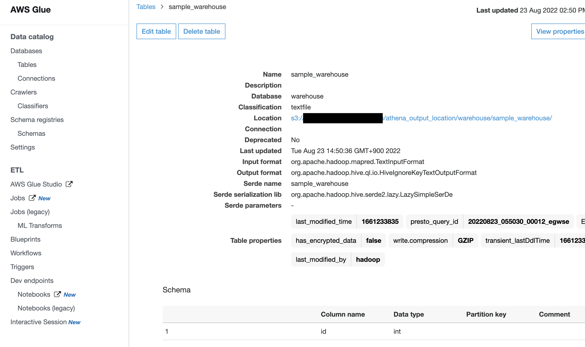

# Abstruct

With the development of modern data stacks, it is getting way easy to establish an useful data infrastructure. A lot of people spent much time to investigate and build them. However, as for dbt x aws, there are no resources on the internet. Therefore, I am going to give you a lecture about that.

# Goal

I reckon that providing the results makes you understood more efficiently, so pasting some pictures.





Some people might be surprised because of the multiple databases. Actually, the idea behind the dbt is to use single database.

- [https://docs.getdbt.com/docs/faqs/connecting-to-two-dbs-not-allowed](https://docs.getdbt.com/docs/faqs/connecting-to-two-dbs-not-allowed)

# Content

First of all, I am going to split my data-warehouse into 4 layers for better data management.

- raw layer
    - store data as raw format, responsible for copying the datasource
- interface layer
    - canonicalize data
- warehouse layer
    - build the specific domain data by aggregation
- mart layer
    - store data for reverseETL

## Prerequisites

In addition, I assume that the required infra resources such as athena-database have already been created. In my case, those are produced by terraform. The sample code is located on here.

- https://github.com/kiwamizamurai/tmp

## Steps

Ok we are ready. The instruction itself is straightforward.

1. install dbt-athena and create project

```bash
mkdir tmp
cd tmp
poetry init
poetry add dbt-core
poetry add dbt-athena-adapter
```

configure dbt as follows

```bash
❯ poetry run dbt init my_dbt_project
23:02:56  Running with dbt=1.2.0
23:02:56  Creating dbt configuration folder at /Users/your_name/.dbt
Enter a name for your project (letters, digits, underscore): my_dbt_project
Which database would you like to use?
[1] athena

(Don't see the one you want? https://docs.getdbt.com/docs/available-adapters)

Enter a number: 1
s3_staging_dir (S3 location to store Athena query results and metadata): s3://hogehoge-bucket/athena_output_location/
region_name (AWS region of your Athena instance): ap-northeast-1
schema (Specify the schema (Athena database) to build models into (lowercase only)): some_athena_database_for_default
database (Specify the database (Data catalog) to build models into (lowercase only)): awsdatacatalog
23:04:22  Profile my_dbt_project written to /Users/your_name/.dbt/profiles.yml using target's profile_template.yml and your supplied values. Run 'dbt debug' to validate the connection.
23:04:22
Your new dbt project "my_dbt_project" was created!

For more information on how to configure the profiles.yml file,
please consult the dbt documentation here:

  https://docs.getdbt.com/docs/configure-your-profile

One more thing:

Need help? Don't hesitate to reach out to us via GitHub issues or on Slack:

  https://community.getdbt.com/

Happy modeling!
```

2. create `tmp/my_dbt_project/profiles.yml`  for the connection of athena 
    1. By default, this configuration file is created at `/Users/your_name/.dbt/profiles.yml`
    2. if you belongs to some team, it might be a good idea to share this. And I do so.

```yaml
my_dbt_project:
  target: dev
  outputs:
    dev:
      type: athena
      s3_staging_dir: s3://hogehoge-bucket/athena_output_location/
      region_name: ap-northeast-1
      schema: some_athena_database_for_default
      database: awsdatacatalog
      poll_interval: 5
      work_group: some_athena_work_group # enforce_workgroup_configuration = false
      num_retries: 1
```

3. confirm the connection is healthy

```bash
 poetry run dbt debug --project-dir ./ --profiles-dir ./
```

4. create a macro `tmp/my_dbt_project/macros/get_custom_schema.sql` for custom schema so that we can use multiple databases

```sql

  
  
    {{ default_schema }}
  
    {{ custom_schema_name | trim }}
  

```

5. stratify the directory by modifying the models section of `tmp/my_dbt_project/dbt_project.yml`
    1. the right-hand side is the name for actual `aws_athena_database` resource
    2. the left-hand side is the folder name corresponding to the resource
        1. `tmp/my_dbt_project/models/{raw,interface,warehouse,mart}`

```yaml
models:
  my_dbt_project:
    raw:
      schema: raw
      +materialized: table
    interface:
      schema: interface
      +materialized: table
    warehouse:
      schema: warehouse
      +materialized: table
    mart:
      schema: mart
      +materialized: table
```

6. prepare the sample athena-dataset, athena-table and csv file
    1. create athena-database which is called `raw`
    2. create athena-table in `raw` database which is called sample
        1. image that name sample is the name of some particular table which is integrated from any datasource 
        2. Parameter Location should be `s3://hogehoge-bucket/athena_output_location/raw/sample/`
    3. upload sample.csv on `s3://hogehoge-bucket/athena_output_location/raw/sample/`

7. create `tmp/my_dbt_project/models/raw/sample_source.yaml`

```yaml
version: 2

sources:
  - name: raw
    tables:
      - name: sample
        identifier: "\"sample\"" # like this
        columns:
          - name: col1
          - name: col2
```

8. write a sample sql for the interface layer `tmp/my_dbt_project/models/interface/sample.sql`
    1. need to specify `external_location`

```sql
{{
    config(
        materialized='table',
        format='textfile',
        external_location='s3://hogehoge-bucket/athena_output_location/interface/sample/'
    )
}}

select col1 from {{source('raw', 'sample')}}
```

9. execute command

```bash
poetry run dbt run --project-dir ./ --profiles-dir ./
```

1. go into the aws console and confirm that athena-database and athena-table is created

# miscellaneous

When you create your own data-warehouse with your like-minded peers, you must want a coding rule on SQL. In this section, I am going to show you how to prepare team development.

1. install library

```bash
poetry add sqlfluff
```

1. write a setting of sql linter

```bash
cd my_dbt_project
touch .sqlfluff
touch .sqlfluffignore
```

`.sqlfluff` is like this

```yaml
[sqlfluff:rules]
tab_space_size = 4
max_line_length = 80
indent_unit = space
comma_style = trailing

[sqlfluff:rules:L010]
capitalisation_policy = lower

[sqlfluff:rules:L011]
# Aliasing preference for tables
aliasing = explicit

[sqlfluff:rules:L012]
# Aliasing preference for columns
aliasing = explicit

[sqlfluff:rules:L014]
capitalisation_policy = lower
unquoted_identifiers_policy = column_aliases

[sqlfluff:rules:L016]
ignore_comment_lines = True
max_line_length = 100
tab_space_size = 2

[sqlfluff]
templater = dbt
dialect = athena

[sqlfluff:templater:dbt]
project_dir = .
profiles_dir = .
profile = my_dbt_project
target = dev
```

`.sqlfluffignore` is like this

```yaml
dbt_packages/
macros/
```

1. confirm sqlfluff works well

```bash
❯ poetry run sqlfluff lint ./models/mart/should_be_formatted.sql
== [my_dbt_project/models/mart/should_be_formatted.sql] FAIL

L:   1 | P:   1 | L050 | Files must not begin with newlines or whitespace.
L:  10 | P:   1 | L046 | Jinja tags should have a single whitespace on either
                       | side: {{config(materialized='table')}}
L:  14 | P:   5 | L036 | Select targets should be on a new line unless there is
                       | only one select target.
L:  16 | P:   5 | L036 | Select targets should be on a new line unless there is
                       | only one select target.
L:  20 | P:   1 | L010 | Keywords must be lower case.
L:  20 | P:   1 | L036 | Select targets should be on a new line unless there is
                       | only one select target.
L:  20 | P:  11 | L012 | Implicit/explicit aliasing of columns.
L:  20 | P:  28 | L012 | Implicit/explicit aliasing of columns.
All Finished 📜 🎉!
```

Furthermore, I use this linter and formatter with `pre-commit.`

`.pre-commit-config.yaml`

```yaml
repos:
  - repo: https://github.com/pre-commit/pre-commit-hooks
    rev: v4.0.1
    hooks:
    -   id: trailing-whitespace
    -   id: end-of-file-fixer
    -   id: check-added-large-files
        args: ['--maxkb=60000']
    -   id: check-toml
    -   id: check-yaml
    -   id: check-json
    -   id: detect-aws-credentials
    -   id: detect-private-key
  - repo: https://github.com/sqlfluff/sqlfluff
    rev: 1.3.0
    hooks:
      - id: sqlfluff-lint
        args: ["--dialect", "athena"]
        additional_dependencies:
          ["dbt-athena-adapter", "sqlfluff-templater-dbt"]
```

If you have any questions or requests, please leave the comment below. And, I’ll be happy if you like and share this post. Thank you.

# References

- [https://github.com/Tomme/dbt-athena](https://github.com/Tomme/dbt-athena)
- [https://github.com/sqlfluff/sqlfluff](https://github.com/sqlfluff/sqlfluff)
- [https://docs.aws.amazon.com/athena/latest/ug/workgroups-troubleshooting.html](https://docs.aws.amazon.com/athena/latest/ug/workgroups-troubleshooting.html)
- [https://zenn.dev/tenajima/articles/f4f99caab361c1](https://zenn.dev/tenajima/articles/f4f99caab361c1)
- [https://pre-commit.com/](https://pre-commit.com/)